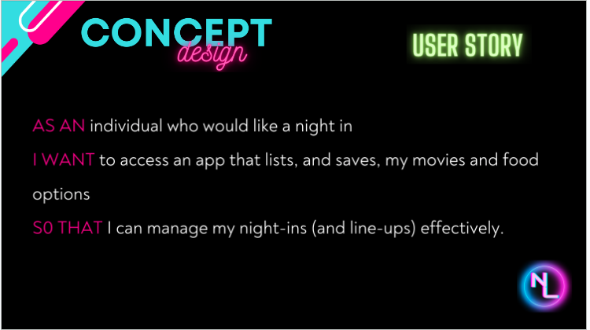
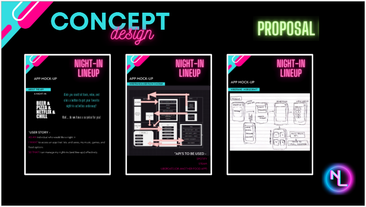
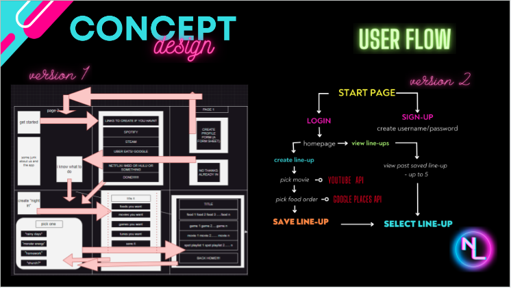
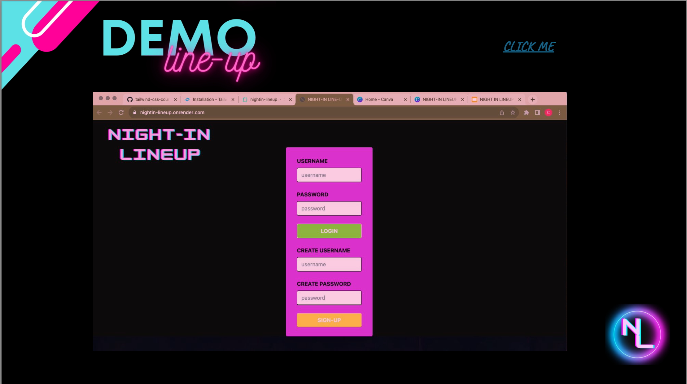

# An Interactive Front-End Project

## Meet the Developers

Jacob Hairfield, Devon Whitaker, and Christine Campbell

## Project Overview

We have been tasked to utilize the knowledge we have obtained over the past six weeks to create a real-world front-end application that we will showcase to potential employers.

## UX Design

Our website was designed with the user in mind - mimicking the same enviorment we wish for the user to love; a night-in at home.

The open design, although a first iteration, helps the user seamlessly pick their night-in line-up. The dark theme and flourescent composition imitate the bustling night-life, without compromising the cozy mood. 

### User Story

## Concept Design Presentation

## User Flow

## DEMO

## Featured Technologies & Sources
Here's a list of technologies used:

1. [Tailwind CSS Framework](https://tailwindcss.com/docs/border-width) - for overall styling of the website.

2. [Google Maps (Places API)](https://developers.google.com/maps/documentation/places/web-service/overview) - the map includes pre-populated places for stored restuarants.

3. [Geolocation API](https://developers.google.com/maps/documentation/geolocation/overview) - pulling location of the user.

4. [Rapid API](https://rapidapi.com/) - formatted data for searched movies.

5. JavaScript/jQuery - add functionality to the website.

6. Git - ensuring proper version control through the group

7. Render - Deployed static application through render to deploy from  ./build/index.html

### Deployed Links

1. [GitHub Repository](https://github.com/christiecamp/night-in-lineup)

2. [Deployed Link on render](https://nightin-lineup.onrender.com)

